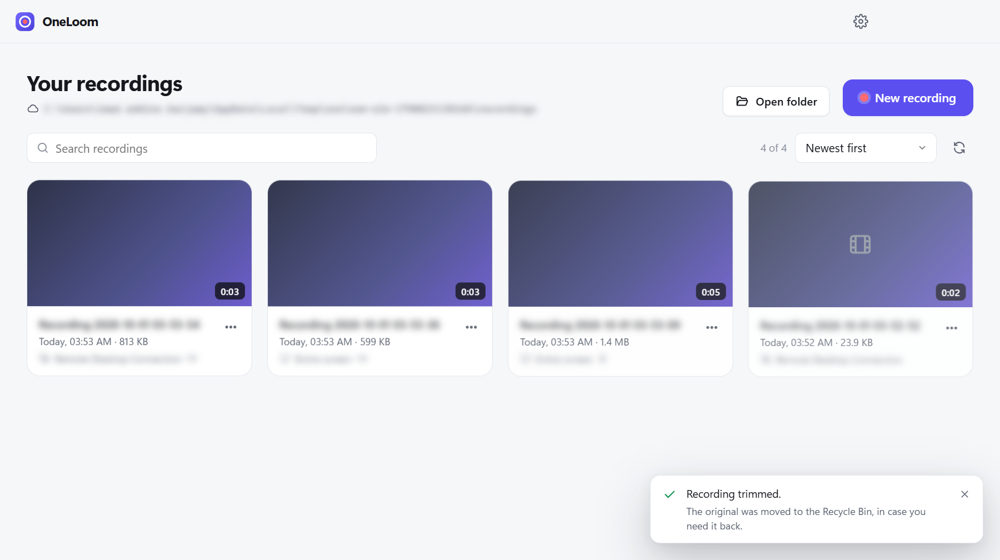
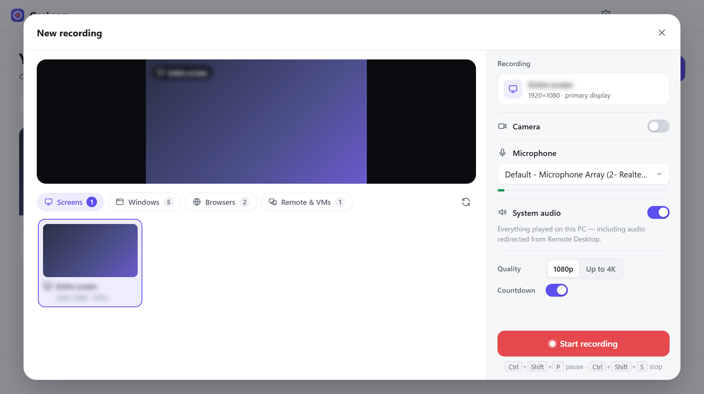
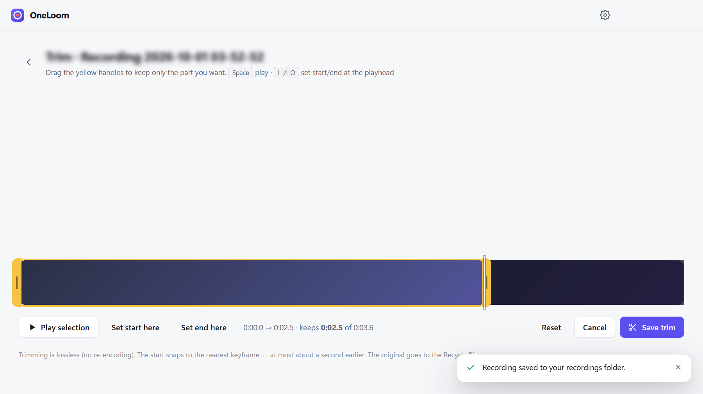
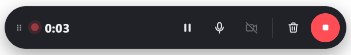

# OneLoom

**OneLoom** is a fast, local screen recorder for Windows 10/11, inspired by the Loom workflow.
Record your screen, an app window, or a **Remote Desktop / virtual-desktop window** with
microphone, system audio and a **floating webcam bubble** (background blur or a custom background).
Trim recordings without re-encoding. Everything is saved automatically to
**`%OneDrive%\loom\recording\`**. There is no cloud backend and no account.

> 📘 **Installing it on another PC?** Read the step-by-step guide:
> [docs/INSTALL.md](docs/INSTALL.md) (English) · [docs/INSTALL.fr.md](docs/INSTALL.fr.md) (français, *mode opératoire*).

| Library | New recording |
| --- | --- |
|  |  |

| Trim (lossless) | Floating controls (not captured) |
| --- | --- |
|  |  |

> In the screenshots, screen content, titles and paths are masked on purpose.

## Features

- **Sources:** any monitor, any app window, browser windows, and remote sessions.
  - **Remote & VMs** groups Remote Desktop (`mstsc`), "*Desktop Viewer*" virtual desktops,
    Windows App / AVD, Hyper‑V, VMware/Omnissa Horizon, VirtualBox, Citrix, AnyDesk, TeamViewer
    and similar clients.
  - Classic RDP windows are labelled like `Remote Desktop — VM-DEMO01`.
  - **Minimised windows are listed too.** Picking one restores it so it can be captured.
- **Camera bubble (Loom‑style):**
  - It is a round or rounded window that stays on top while the recorder is open and while you record.
  - Drag it anywhere. Grow or shrink it with its hover buttons or the mouse wheel.
  - Snap it to the left or right corner, or switch shape, from the recorder panel.
  - In screen recordings the bubble is recorded exactly where it is. In window/RDP recordings it is
    composited into the video at the matching position and follows your moves live.
  - During a recording its buttons are hidden so they don't end up in the video. Use the floating
    pill (camera −/+) instead.
- **Camera effects** (Settings › Camera):
  - **Background blur** (light or strong), 4 built‑in backgrounds, or **your own image**;
  - mirror on/off and a live preview.
  - Segmentation runs entirely on this PC (MediaPipe, WebAssembly/WebGL). Nothing is uploaded.
- **Audio:** any microphone with a live level meter, plus system audio (loopback), mixed into one track.
- **Recording flow:** live preview → 3‑2‑1 → a small always‑on‑top pill. The pill has a timer,
  pause/resume, mic mute, camera on/off and size, discard and stop. The pill and the countdown are
  excluded from the capture.
- **Trim, like Loom:**
  - In the "…" menu or on the player: drag the yellow start/end handles on a filmstrip timeline,
    preview just the kept part, then save.
  - It is **lossless** (no re‑encoding, no FFmpeg). The original goes to the Recycle Bin.
- **Library:** thumbnails, duration, size, date, search and sort. Actions: play, rename (renames the
  file), trim, open in the default player, show in Explorer, copy path, delete (to the Recycle Bin).
- **Safe storage:**
  - Video is streamed to disk in 1‑second chunks, so a 1‑hour recording never sits in RAM.
  - A crash, an offline OneDrive folder, a full disk or a filename collision never loses footage.
- **Tray and global shortcuts.** Optional start at sign‑in.

## Quick start (development)

Requirements: Windows 10/11 and Node.js ≥ 22.12. No admin rights are needed.

```powershell
git clone https://github.com/imadui/ScreenOP.git
cd ScreenOP
npm install
npm run dev          # Vite dev server on 127.0.0.1 + Electron with hot reload
```

| Script | What it does |
| --- | --- |
| `npm run dev` | Development mode. |
| `npm run build` | Type‑check (main, renderer, e2e) and bundle into `out/`. |
| `npm run test` | Unit tests (Vitest). |
| `npm run test:e2e` | End‑to‑end tests on the real desktop (Playwright + Electron). |
| `npm run dist` | Portable app in `release/win-unpacked/` + `release/OneLoom-<version>-win-x64.zip`. |
| `npm run dist:installer` | NSIS installer (needs electron‑builder's 7‑Zip; see the install guide). |
| `npm run assets` | Copy the MediaPipe WebAssembly runtime from `node_modules` into `resources/mediapipe/`. |
| `npm run icons` | Regenerate the app and tray icons (pure Node). |

All tooling stays inside the project: `node_modules` is local, and the Electron and
electron‑builder caches go to the git‑ignored `.cache/` (see `scripts/run-local.mjs`).

## Where recordings go

```
%OneDrive%\loom\recording\Recording_2026-09-30_21-15-34.webm
```

The OneDrive root is resolved dynamically; no user name is hard‑coded. OneLoom tries, in order:

1. `%OneDrive%`
2. `%OneDriveCommercial%`
3. `%OneDriveConsumer%`
4. `HKCU\Software\Microsoft\OneDrive\Accounts\*\UserFolder`

`loom\recording` is created automatically. If OneDrive isn't set up, pick another folder in
**Settings**. Name collisions get ` (2)`, ` (3)`, … appended.

Metadata (title, date, duration, source, mic/camera flags) lives in `%APPDATA%\OneLoom\library.json`.
Thumbnails live in `%APPDATA%\OneLoom\thumbnails`, and custom camera backgrounds in
`%APPDATA%\OneLoom\backgrounds`. **Videos are never duplicated into app data.** The folder is the
source of truth; even renames done in Explorer keep their metadata.

## Architecture

```
src/
  main/            Electron main process
    index.ts         bootstrap: windows, tray, shortcuts, IPC, recovery
    recording/       RecordingController (state machine), EngineHost (hidden engine window),
                     ChunkFileWriter, finalize (temp → OneDrive), session recovery
    camera/          CameraBubble (floating camera window), custom backgrounds
    webm/            EBML primitives, streaming finaliser (Duration/Cues/SeekHead), lossless trim
    capture/         source enumeration (+ minimised windows, window→process map, restore)
    library/ storage/ protocol.ts sharing.ts ipc.ts tray.ts shortcuts.ts permissions.ts windows/
  preload/         typed contextBridge API (the renderer's only door to the OS)
  renderer/        React UI (Vite)
    pages/           Home, Player, Trim, Bubble (camera window), Controller (pill), Countdown
    components/      recorder/, camera/, library/, …
    services/        recorder/ (engine, capture, audio mixer, compositor), camera/effects, filmstrip
  shared/          pure, unit‑tested logic (sources, filenames, layout, codecs, backgrounds, …)
  types/           domain types
resources/mediapipe/  selfie segmentation model (+ WebAssembly runtime copied by `npm run assets`)
tests/unit/        Vitest     tests/e2e/   Playwright (Electron)
```

**Recording pipeline:**
1. A hidden *engine* window captures the chosen screen/window (`chromeMediaSource: 'desktop'`), the
   microphone and system audio.
2. If needed, it composites the camera. For window/RDP recordings that means a capture of the
   bubble window, drawn on a steady 30 fps clock.
3. It encodes with MediaRecorder: VP9/Opus, VP8 fallback, a keyframe every second.
4. Each 1‑second chunk is appended to a temp file. On stop, a streaming rewrite adds Duration, Cues
   and a SeekHead, and the file is moved into OneDrive without ever overwriting anything.

**Security:**
- Every window runs with `contextIsolation`, `sandbox` and no Node integration.
- The main process re‑validates every IPC argument; the renderer sends ids, never file paths.
- Engine and bubble channels only accept their own window.
- Navigation and pop‑ups are blocked, and the production CSP is strict.
- The local `oneloom-media://` scheme serves only allowlisted files.

## Remote Desktop, Citrix and other VMs

- OneLoom runs on **your** PC and records the **local client window**. Nothing is installed in the VM.
- Pick the session in **Remote & VMs**. If it is minimised, OneLoom restores it.
- Keep the session window visible while recording. When minimised, clients stop drawing.
- VM audio is recorded through **System audio** when the session plays sound on this PC.
- If the session window closes or disconnects, recording stops and the file is saved.

## Browser tabs

An external app cannot capture individual Chrome/Edge tabs, and OneLoom doesn't fake it. Record the
browser **window** (keep the tab in front, or pop the tab out into its own window).
`CaptureSourceProvider` (`src/main/capture/SourceService.ts`) is the extension point for a future
browser‑extension tab provider.

## Limitations

- **System audio:** it is the whole PC mix (Chromium WASAPI loopback). If loopback capture fails,
  recording continues without it and the app says so.
- **Camera bubble:**
  - Its hover buttons can appear in a screen recording if you hover it before recording; during
    recording they are hidden.
  - Background segmentation is good, not perfect: hair and fast motion can show edge artefacts.
- **Trim:** a lossless cut can only start on a keyframe (recordings have one every second), so the
  start may move up to ~1 s earlier. The end is exact.
- **Overlay exclusion:** the overlays are hidden from captures with `WDA_EXCLUDEFROMCAPTURE`
  (Windows 10 2004+).
- **Output format:** WebM (VP9/Opus).
- **Code signing:** the build is not signed. SmartScreen or endpoint security may warn; sign it
  with your organisation's certificate before distributing it widely.
- **Slow first start on managed PCs:** endpoint security can make the first start of
  Chromium‑based apps slow (15–25 s here). Enable *Start OneLoom when I sign in* to keep it ready
  in the tray.

## Privacy on a work PC

- With OneDrive for work or school, recordings sync to your tenant. Treat them like any work file.
- The log (`%APPDATA%\OneLoom\logs\oneloom.log`) contains recorded window titles and paths, but
  no credentials.
- To tag RDP/VM/browser windows (and list minimised ones), the picker runs one read‑only
  `Get-Process` through `powershell.exe -NoProfile -NonInteractive -Command`. It runs at most every
  15 s and only while the picker is open; it uses no script file and changes no execution policy.
- **Restore a minimised window** uses Windows UI Automation (a .NET assembly that ships with
  Windows). Nothing is compiled and no keystrokes are injected.

## Keyboard shortcuts (global)

| Shortcut | Action |
| --- | --- |
| `Ctrl + Shift + R` | Open the recorder |
| `Ctrl + Shift + P` | Pause / resume (only while recording) |
| `Ctrl + Shift + S` | Stop and save (only while recording) |

In the trim editor: `Space` play/pause, `I` / `O` set start/end at the playhead, `Esc` back.

## Sharing (extension point)

Today: **Copy file path** and **Show in OneDrive folder**. From Explorer, right‑click the file and
choose **Share** to create a OneDrive link. A future Microsoft Graph provider plugs into
`SharingProvider` (`src/main/sharing.ts`); no upload is needed, because files already live under
the OneDrive root.

## Testing

```powershell
npm run test        # unit tests (WebM finaliser, trim, OneDrive resolution, source classification,
                    # library merge, recording state machine, …)
npm run test:e2e    # end-to-end on the real desktop (records your screen for a few seconds)
```

The e2e suite drives the real app. It covers:

- OneDrive detection;
- source enumeration, with a real `mstsc.exe` window detected and recorded;
- screen recording with mic/system audio, including pause/resume;
- playback checks (duration, seeking, audio);
- the camera bubble (resize, effects), recorded with the screen and composited into an RDP‑window
  recording;
- lossless trim from the editor;
- rename, Explorer, relaunch persistence, tray / single instance, and delete.

By default it uses a temporary folder. Set `ONELOOM_E2E_REAL_ONEDRIVE=1` to validate the real
OneDrive folder; test files are removed through the app afterwards. Development‑only overrides
(ignored by the packaged app): `ONELOOM_USER_DATA_DIR`, `ONELOOM_RECORDINGS_DIR`.

## License

[MIT](LICENSE). Third‑party components: see [THIRD_PARTY_NOTICES.md](THIRD_PARTY_NOTICES.md).
